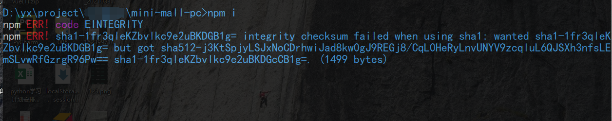

# npm i 装包出现sha1报错咋办？

## 情景：刚拉的代码，安装依赖包 出现报错

##百度过后 说用清除npm 缓存的方式

npm cache verify
npm cache clean --force

但是经过我的尝试 并没有什么用
依然报错

##粗暴的手法

直接把package-lock.json删除

成功！

延伸：
package-lock.json  是干嘛的?

## 13. 正则
new RegExp()
/^1[3, 4, 5, 7, 8, 9]\d{9}$/
修饰符：i:ignore 忽略大小写
g :global  全局匹配
m：mulite-line  多行匹配 